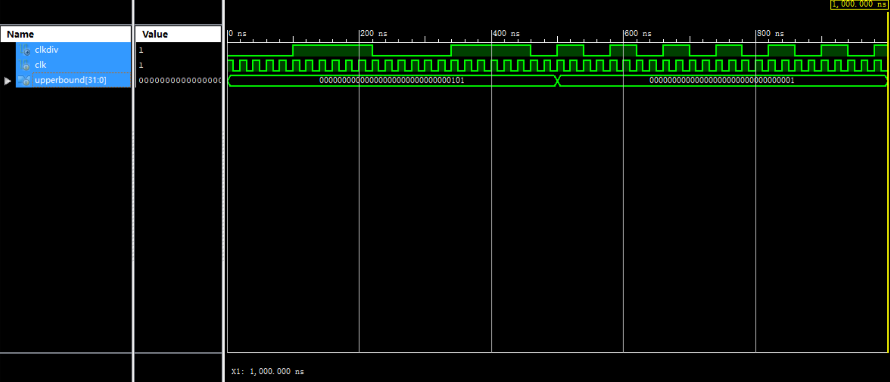

# ClkDiv 模块

## 基本信息

### 输入

* `input wire clk`: 时钟
* `input wire [31:0] upperbound`: 分频倍数

### 输出

* `output reg clkdiv`: 分频后的时钟

### 行为

时钟分频器

### 仿真模拟

如图，当分频倍数为 5 时，`clkdiv` 的周期是 `clk` 的 5 倍；当分频倍数为 1 时，`clkdiv` 的周期是 `clk` 的 1 倍。且在从 5 倍切换到 1 倍的时候，没有发生溢出的问题。符合预期。
