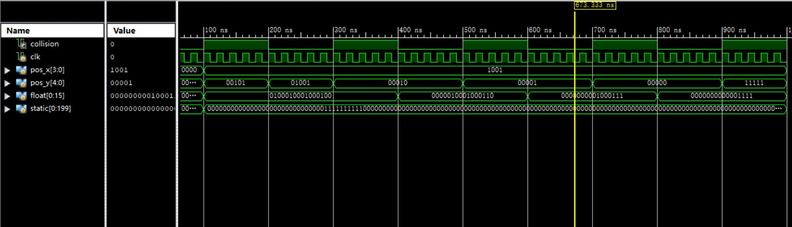
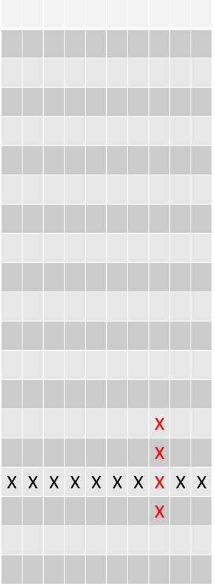
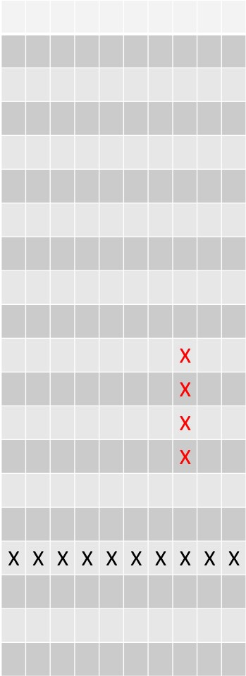
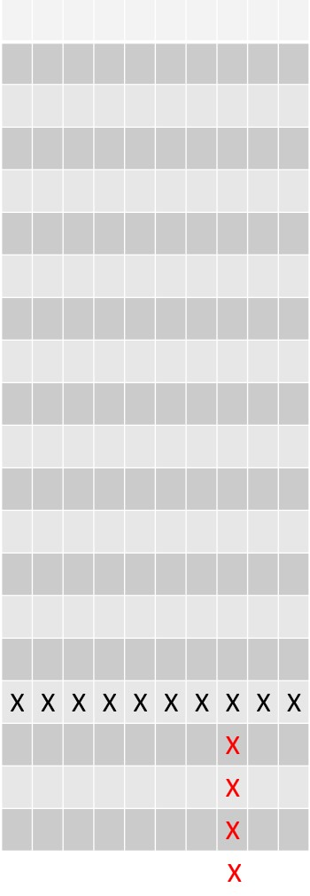
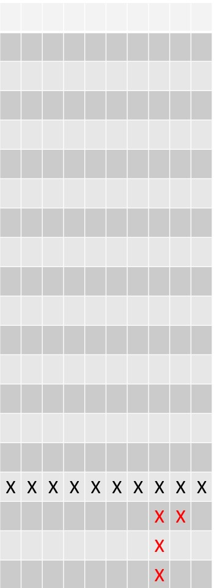

# CollisionChecker 模块

## 输入

+ `input wire clk` 时钟
+ `input wire [3:0] pos_x`,  正在下落的方块的锚点 x 坐标
+ `input wire [4:0] pos_y`,  正在下落的方块的锚点 y 坐标
+ `input wire [0:15] float`, 正在下落方块所在的 4 * 4 区域哪些是有方块的
+ `input wire [0:199] static`, 除下落方块外，目前局面的方块布局

## 输出

+ `output wire valid`  方块是否能下落（即有碰撞的取反）

## 功能用途

+ 判断有无碰撞，让上级判断是否可以移动或者暂停方块的运动。
+ 包含是否和左右边缘碰撞，是否落到了底部，以及是否和现在的已有方块格局碰撞。

## 仿真

 

总共测试了多种碰撞与不碰撞的情况。

