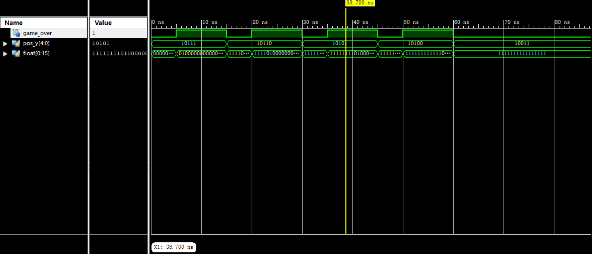

# GameOverChecker 模块

## 基本信息

### 输入

* `input wire [4:0] pos_y`: 当前浮动模块锚点在游戏界面中的纵坐标
* `input wire [0:15] float`: 当前浮动模块状态

### 输出

* `output wire game_over`: 玩家是否死亡（游戏是否结束）

### 行为

组合逻辑电路，如果浮动模块在超出游戏界面的部分有俄罗斯方块，则游戏结束

## 仿真模拟

以仿真图中第 38.700ns 为例，此时浮动模块第三行有 1 个俄罗斯方块，且方块位置映射到游戏界面上在界面之上一行，所以游戏已经结束，输出一，符合预期
