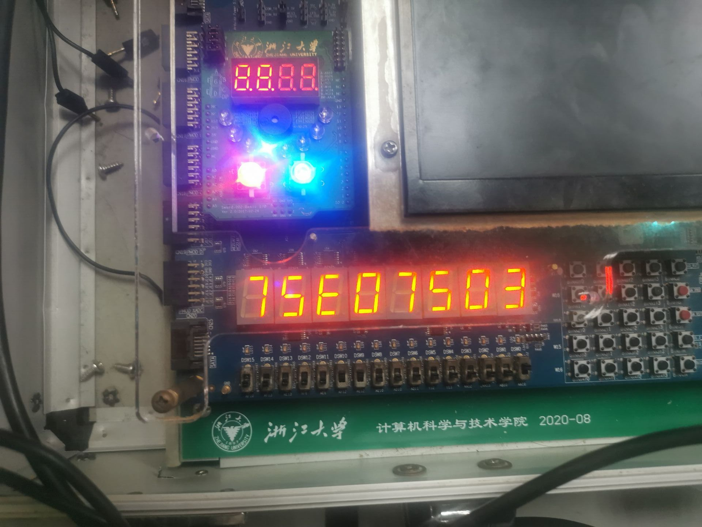
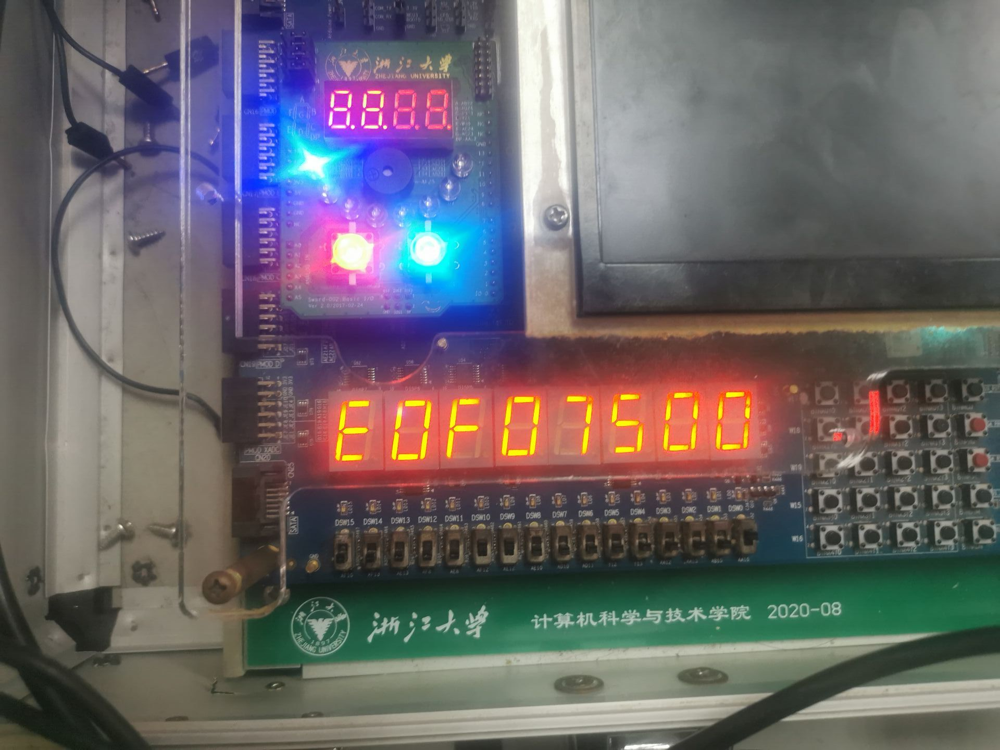

# Keyboard 模块

## 基本信息

### 输入

* `input wire clk`: 板上的时钟
* `input wire ps2_clk`: 键盘的时钟
* `input wire ps2_data`: 键盘串行输入

### 输出

* `output wire [2:0] key`: 当前按下的键
  * 0: 没有键被按下
  * 1: esc 键被按下
  * 2: 空格键被按下
  * 3: 向上键被按下（包括 w, k 和向上箭头键）
  * 4: 向下键被按下（包括 s, j 和向下箭头键）
  * 5: 向左键被按下（包括 a, h 和向左箭头键）
  * 6: 向右键被按下（包括 d, l 和向右箭头键）
  * 7: 上述没有被提到的键被按下

### 代码逻辑

* 子模块 `ps2_keyboard`
  * 将键盘串行输出的 PS/2 码转为并行输出并作校验
  * 通过调用子模块 `ZigZagGen`，在串行输出读完之后 `valid` 变为 $1'b1$ 并持续一个周期
* Keyboard
  * 调用子模块 `ps2_keyboard` 读入当前的键盘输出的 PS/2 码
  * 由于 $8'hE0$ 仅在箭头键出现用以区分小键盘区域的箭头键和单独的四个箭头键，且在程序逻辑中这两组键的行为是一致的，所以若当前的码为 $8'hE0$ 则直接忽略
  * 若键盘上一次输出的码为 $8'hF0$ 则意味着这个键被释放，输出 $8'd0$
  * 根据按下的键的 PS/2 码决定输出的值，详见输出部分

## 上板测试

由于该模块模拟仿真比较麻烦，直接上板测试，板上显示4个数，左边3个数为最近三个键盘输出（左侧为最旧的），最右边一个数为本模块的输出，同时本模块输出的数对应的 LED 灯也会亮起，防止 LED 模块刷新不够快导致误以为模块有问题

如下图为按下向上箭头键时的输出，符合预期

如下图是什么键都不按下时的输出，符合预期

