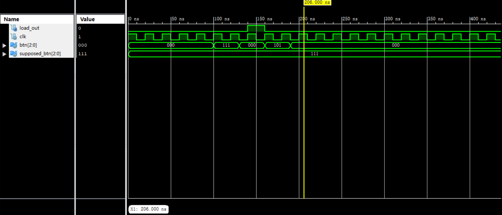

# LoadGen 模块

## 基本信息

### 输入

* `input wire clk`: 时钟
* `input wire [2:0] btn`: 按钮状态
* `input wire [2:0] supposed_btn`: 期望的按钮数值

### 输出

* `output reg load_out`: 激活状态

### 行为

当按钮为期望的按钮且为下降沿时输出一个周期的高电平

## 仿真模拟

在第 140ns 左右，按钮从 111 变为 0，输出了 1 个周期的高电平。在第 200ns 左右，虽然按钮是下降沿，但按下的按钮不是期望的按钮，所以输出的还是低电平，符合预期。
