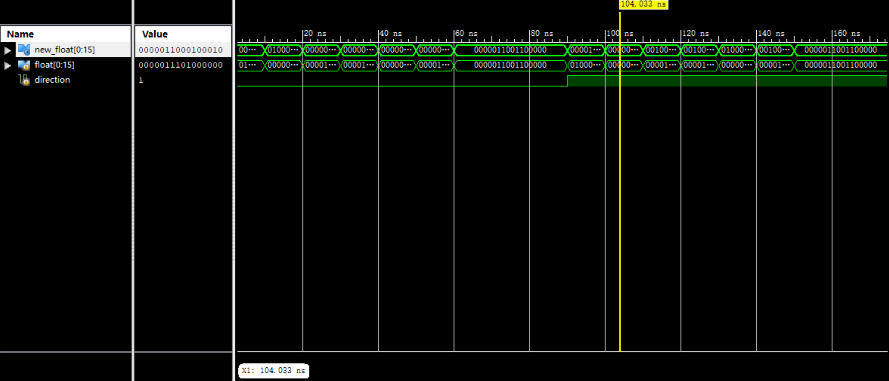

# Rotate 模块

## 基本信息

### 输入

* `input wire [0:15] float`: 当前浮动模块状态
* `input wire direction`: 旋转方向（0 顺时针，1 逆时针）

### 输出

* `output wire [0:15] new_float`: 旋转后的浮动模块状态

### 行为

组合逻辑电路，输出旋转 $90\degree$ 后的浮动模块的状态

## 仿真模拟

以仿真图中第 104.033ns 为例，此时输入的是下图所示的俄罗斯方块

输出的是如下图所示的俄罗斯方块

整个仿真结果体现了这个模块工作正常，符合预期
