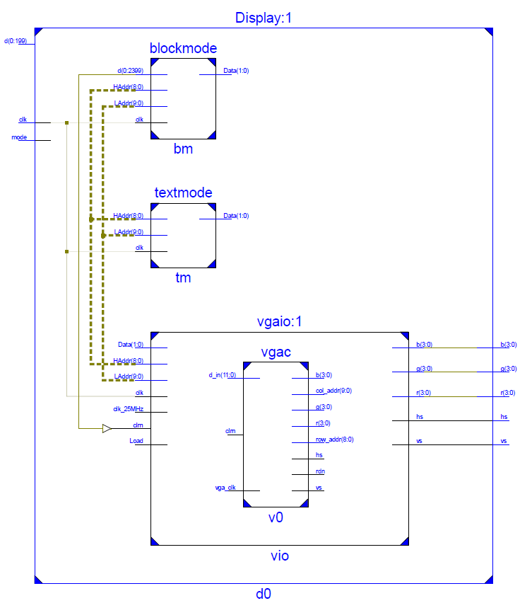

# Display

## VGA原理

​	VGA显示是利用行列扫描实现的，本工程采用标准的640\*480分辨率，即显示区每行640像素，共480行。由于扫描存在惯性，所以在显示区域外存在过冲，以本工程采用的标准VGA为例，每行需要800个像素点的时间，其中同步脉冲96个像素点、返回过冲45个像素点，前过冲13个像素点，留6个富余像素作为两边边缘；同样每幅需要525行，其中帧同步脉冲2行、返回过冲30行、前过冲9行，留4行富余作为上下边缘。由于电子束包含返回时间，返回过冲时间必须足够大。若VGA采用59.94（60）Hz刷新频率，计算可得完成扫描的时钟频率为25MHz，方便进行时钟分频。SWORD平台上提供的VGA显示接口为12位色深，RGB三通道共支持4096色，即每个像素点扫描需要提供12位的色彩数据。

## 显示模块设计目标

- 显示“GAME OVER！”界面
- 显示输入的游戏状态，添加边缘区域

## 显示模块层次设计

- vgac模块：采用自提供的vga_demo，功能是输出当前扫描位置，获取扫描位置的色彩数据，向板上VGA接口输出色彩信息与行列同步信号。
- vgaio模块：实现简单的VRAM显示缓存，以行、列地址、数据与写入信号输入控制，实现扫描模块与显示内容的解耦。
- Display模块：封装整个显示逻辑，接受核心游戏逻辑提供的状态参数，将其以特定逻辑映射至VRAM。
- blockmode模块：将屏幕划分为40\*30的块，输入由Display模块处理的屏幕块信息，输出串行写入信号。
- textmode模块：从字符点阵ROM中读取数据，生成“GAME OVER！”画面，输出串行写入信号。
- 

## 模块实现

### vgac模块

```verilog
module vgac (vga_clk,clrn,d_in,row_addr,col_addr,rdn,r,g,b,hs,vs); // vgac
   input     [11:0] d_in;     // bbbb_gggg_rrrr, pixel
   input            vga_clk;  // 25MHz
   input            clrn;
   output reg [8:0] row_addr; // pixel ram row address, 480 (512) lines
   output reg [9:0] col_addr; // pixel ram col address, 640 (1024) pixels
   output reg [3:0] r,g,b; // red, green, blue colors
   output reg       rdn;      // read pixel RAM (active_low)
   output reg       hs,vs;    // horizontal and vertical synchronization
   // h_count: VGA horizontal counter (0-799)
   reg [9:0] h_count; // VGA horizontal counter (0-799): pixels

   always @ (posedge vga_clk) begin
       if (!clrn) begin
           h_count <= 10'h0;
       end else if (h_count == 10'd799) begin
           h_count <= 10'h0;
       end else begin 
           h_count <= h_count + 10'h1;
       end
   end
   // v_count: VGA vertical counter (0-524)
   reg [9:0] v_count; // VGA vertical   counter (0-524): lines
   always @ (posedge vga_clk or negedge clrn) begin
       if (!clrn) begin
           v_count <= 10'h0;
       end else if (h_count == 10'd799) begin
           if (v_count == 10'd524) begin
               v_count <= 10'h0;
           end else begin
               v_count <= v_count + 10'h1;
           end
       end
   end

    // signals, will be latched for outputs
    wire  [9:0] row    =  v_count - 10'd35;     // pixel ram row addr 
    wire  [9:0] col    =  h_count - 10'd143;    // pixel ram col addr 
    wire        h_sync = (h_count > 10'd95);    //  96 -> 799
    wire        v_sync = (v_count > 10'd1);     //   2 -> 524
    wire        read   = (h_count > 10'd142) && // 143 -> 782
                         (h_count < 10'd783) && //        640 pixels
                         (v_count > 10'd34)  && //  35 -> 514
                         (v_count < 10'd515);   //        480 lines
    // vga signals
    always @ (posedge vga_clk) begin
        row_addr <=  row[8:0]; // pixel ram row address
        col_addr <=  col;      // pixel ram col address
        rdn      <= ~read;     // read pixel (active low)
        hs       <=  h_sync;   // horizontal synchronization
        vs       <=  v_sync;   // vertical   synchronization
        r        <=  rdn ? 4'h0 : d_in[3:0]; // 4-bit red
        g        <=  rdn ? 4'h0 : d_in[7:4]; // 4-bit green
        b        <=  rdn ? 4'h0 : d_in[11:8]; // 4-bit blue
    end
endmodule
```

本模块代码取自VGAdemo，默认其正确性，功能是进行800\*525区域的扫描工作，判断扫描点是否在显示区域内，输入12位像素点色彩数据，输出当前扫描坐标与板上引脚信号。

## vgaio模块

```verilog
module vgaio(input wire clk,
             input wire clk_25MHz,
             input wire clrn,
             input wire Load,
             input wire[8:0] HAddr, //write row address
             input wire[9:0] LAddr, //write col address
             input wire[1:0] Data,  //write data
             output wire[3:0] r,
             output wire[3:0] g,
             output wire[3:0] b,
             output wire hs,
             output wire vs);
    
    wire[8:0] row_addr;
    wire[9:0] col_addr;
    
    reg[11:0] Dotout;
    wire[18:0] DotAddr; //read address
    wire[18:0] LoadAddr; //write address
    
    assign DotAddr  = row_addr*640+col_addr;
    assign LoadAddr = HAddr*640+LAddr;
    
    wire[1:0] ram_read;

    vram ram (  // vga display memory
    .clka(clk), // input clka
    .wea(Load), // input [0 : 0] wea
    .addra(LoadAddr), // input [18 : 0] addra
    .dina(Data), // input [1 : 0] dina
    .clkb(clk), // input clkb
    .addrb(DotAddr), // input [18 : 0] addrb
    .doutb(ram_read) // output [1 : 0] doutb
    );
    
    always@(posedge clk_25MHz) begin
        case(ram_read)
            2'b00:Dotout<=12'h000; //black
            2'b01:Dotout<=12'hF00; //blue
            2'b10:Dotout<=12'h0F0; //green
            2'b11:Dotout<=12'h00F; //red
            //3'b100:Dotout<=12'hF5B; //pink
            //3'b101:Dotout<=12'h5FF; //yellow
            //3'b110:Dotout<=12'h777; //gray
            //3'b111:Dotout<=12'hFFF; //white
        endcase
    end

    vgac v0 (.vga_clk(clk_25MHz),.clrn(clrn),.d_in(Dotout),.row_addr(row_addr),.col_addr(col_addr),.r(r),.g(g),.b(b),.hs(hs),.vs(vs));

endmodule
```

本模块接受vgac模块给出的扫描地址，从vram中读取对应位置的数据（自定义2位颜色编码转12位RBG）返回给vgac模块（存在内存读写越界问题 ，但考虑到vgac的工作逻辑，不会产生任何影响）；另外从模块外部接受写入地址与数据，由Load信号触发写入vram。vram采用ISE提供的ip核实现（Native，Simple dual RAM， 307200\*2，Common clock），是一可以实现同时读写的双口内存。

本模块实现了扫描显示逻辑与图像处理逻辑的解耦，外部处理显示的模块将不必再考虑具体的vga扫描显示逻辑，只需要考虑对vram中的静态图像按一定频率刷新即可。

### blockmode 模块

```verilog
module blockmode(input wire clk,
                 input wire [0:2399] d, //30*40*2 area
                 input wire[8:0] HAddr, //scan row address
                 input wire[9:0] LAddr, //scan col address
                 output reg[1:0] Data);

    wire[4:0] HBlock;
    wire[5:0] LBlock;
    wire[12:0] BAddr;
    assign HBlock      = HAddr[8:4];
    assign LBlock      = LAddr[9:4];
    assign BAddr[12:1] = HBlock*40+LBlock;
    assign BAddr[0]  = 1'b0; //2 bits represent the color of a pixel
    
    always@(posedge clk)
    begin
        if ({d[BAddr],d[BAddr+1]} == 2'b00)
        begin
            Data <= 2'b00;
        end
        else
        begin
            if (HAddr[3:0] == 4'h0||HAddr[3:0] == 4'hF||LAddr[3:0] == 4'h0||LAddr[3:0] == 4'hF)
            begin
                Data <= 2'b00; //the edge of a block should be black
            end
            else
            begin
                case({d[BAddr],d[BAddr+1]})
                    2'd1:Data   <= 2'b11;
                    2'd2:Data   <= 2'b10;
                    2'd3:Data   <= 2'b01;
                endcase
            end
        end
    end
    
endmodule
```

本模块接受一个30\*40\*2的游戏区域，表示屏幕上30*40块的颜色信息，再接受一个640 \*480的行列地址，根据游戏区域给出的信息，输出该行列地址像素点的颜色编码信息。

### textmode 模块

```verilog
module textmode(input wire clk,
                input wire[8:0] HAddr,
                input wire[9:0] LAddr,
                output reg[1:0] Data);
    
    wire[4:0] HBlock;
    wire[6:0] LBlock;
    wire[12:0] BAddr;
    assign HBlock      = HAddr[8:4];
    assign LBlock      = LAddr[9:3];
    assign BAddr[12:0] = HBlock*80+LBlock;
    
    reg [11:0] readAddr;
    wire [7:0] read;
    textrom trom ( //text ROM
    .clka(clk), // input clka
    .ena(1'b1), // input ena
    .addra(readAddr), // input [11 : 0] addra
    .douta(read) // output [7 : 0] douta
    );

    always@(*)
    begin
        case(BAddr)
            13'd1234:readAddr <= 12'd624+HAddr[3:0]; //G
            13'd1235:readAddr <= 12'd528+HAddr[3:0]; //A
            13'd1236:readAddr <= 12'd720+HAddr[3:0]; //M 
            13'd1237:readAddr <= 12'd592+HAddr[3:0]; //E
            13'd1238:readAddr <= 12'd000+HAddr[3:0]; //" "
            13'd1239:readAddr <= 12'd752+HAddr[3:0]; //O
            13'd1240:readAddr <= 12'd864+HAddr[3:0]; //V
            13'd1241:readAddr <= 12'd592+HAddr[3:0]; //E
            13'd1242:readAddr <= 12'd800+HAddr[3:0]; //R
            13'd1243:readAddr <= 12'd016+HAddr[3:0]; //!
            default:readAddr <= 12'h000;
        endcase
    end

    always@(*)
    begin
        case(LAddr[2:0]) //background-blue; text-red
            3'd0:Data<=read[7]?2'b11:2'b01;
            3'd1:Data<=read[6]?2'b11:2'b01;
            3'd2:Data<=read[5]?2'b11:2'b01;
            3'd3:Data<=read[4]?2'b11:2'b01;
            3'd4:Data<=read[3]?2'b11:2'b01;
            3'd5:Data<=read[2]?2'b11:2'b01;
            3'd6:Data<=read[1]?2'b11:2'b01;
            3'd7:Data<=read[0]?2'b11:2'b01;
        endcase
    end
    
endmodule
```

textmode模块根据字符发生ROM产生一幅“GAME OVER！”画面，根据输入的行列地址，返回对应位置的像素点的值。

textrom由预先准备好的字符点阵coe文件通过ISE自带的ip核管理工具生成，属于single port ROM。

### Display模块

```verilog
module Display(input wire clk, //100MHz clock
                input wire mode, //0-game mode 1-text mode
                input wire [0:199] d, //image block
                output wire[3:0] r,
                output wire[3:0] g,
                output wire[3:0] b,
                output wire hs,
                output wire vs);

    
    reg[1:0] clk_div;
    always@(posedge clk) begin
        clk_div <= clk_div + 2'b1;
    end

    wire Load;
    assign Load = ~clk_div[1];
    
    wire[1:0] Data;
    reg[8:0] HAddr;
    reg[9:0] LAddr;

    wire[1:0] D1,D2;
    
    always@(posedge clk_div[1])
    begin
        if (LAddr == 10'd639)
        begin
            LAddr <= 10'b0;
            if (HAddr == 9'd479)
            begin
                HAddr <= 0;
            end
            else
            begin
                HAddr <= HAddr+9'b1;
            end
        end
        else
        begin
            LAddr <= LAddr+10'b1;
        end
    end

    wire[0:2399] dd;
    generate //locate the game area on screen
        genvar ii, jj;
        for(jj=0; jj<30; jj=jj+1) begin
            for(ii=0; ii<40; ii=ii+1) begin
                if((ii==15&&jj>=4&&jj<=25)||(ii==26&&jj>=4&&jj<=25)||(jj==4&&ii>=15&&ii<=26)||(jj==25&&ii>=15&&ii<=26))
                begin:map0
                    assign dd[(jj*40+ii)*2:(jj*40+ii)*2+1]=2'b11;
                end
                else
                begin
                    if(ii>15&&ii<26&&jj>4&&jj<25)
                    begin:map1
                        assign dd[(jj*40+ii)*2:(jj*40+ii)*2+1]=(d[(24-jj)*10+(ii-16)])?2'b01:2'b00;
                    end
                    else
                    begin:map2
                        assign dd[(jj*40+ii)*2:(jj*40+ii)*2+1]=2'b00;
                    end
                end
            end
        end
    endgenerate

    blockmode bm (.clk(clk),.d(dd),.Data(D1),.HAddr(HAddr),.LAddr(LAddr));
    textmode tm (.clk(clk),.Data(D2),.HAddr(HAddr),.LAddr(LAddr));
    
    assign Data=mode?D2:D1;
    
    vgaio vio (.clk(clk),.clk_25MHz(clk_div[1]),.clrn(1'b1),.Load(Load),.HAddr(HAddr),.LAddr(LAddr),.Data(Data),.r(r),.g(g),.b(b),.hs(hs),.vs(vs));
    
endmodule
```

根据输入mode，选择往vram中输出游戏图像或文字图像，实现时钟分频，扫描刷新vram中的静态图像，输入20\*10的俄罗斯方块游戏区域，利用generate语句将其关联至30\*40\*2的块中，在该过程中实现屏幕区域定位和生成游戏区域边缘的功能。

### Combine模块

```verilog
module Combine( //anchor float[15]
         input wire clk,
         input wire [3:0] pos_x, //col 0-12
         input wire [4:0] pos_y, //row 0-22
         input wire [0:15] float,
         input wire [0:199] static,
         output reg [0:199] comb
       );

    reg[4:0] row;
    reg[3:0] col;
    wire[7:0] Addr;
    assign Addr=10*row+col;

    always@(posedge clk) begin
        if(col==4'd9) begin
            col<=0;
            if(row==5'd19) begin
                row<=0;
            end
            else
            begin
                row<=row+1;
            end
        end
        else
        begin
            col<=col+1;
        end
    end

    wire[4:0] row_dis;
    wire[3:0] col_dis;
    wire block;
    assign row_dis=pos_y-row;
    assign col_dis=pos_x-col;
    assign block=(|row_dis[4:2])|(|col_dis[3:2])?(static[Addr]):(static[Addr]|float[(3-row_dis)*4+(3-col_dis)]);

    always@(posedge clk) begin
        comb[Addr]<=block;
    end

endmodule
```

本模块负责将浮动的俄罗斯方块与当前游戏状态合并为一幅静止的点阵图像，本模块采用时序电路设计，扫描整个像素点阵，每个时钟周期刷新一个像素点，根据游戏区域大小，Combine模块一次工作耗时200个时钟周期。由于4\*4的浮动俄罗斯方块二进制下具有很好的数字特性，判断当前像素点是否被覆盖只需要减法组合电路及多输入或门即可实现，产生的负数溢出后经计算不影响判断结果。

## 调试过程

显示模块的初期设计功能仅仅是一个将30\*40的像素点阵映射到VGA显示的模块，后在游戏的主体逻辑和状态表示经讨论决定后，决定增加文字显示的功能，且尽可能与外模块解耦，最后修改输入为功能模式切换和接受10\*20的显示状态。

显示模块调试过程遇到的主要问题有两个：

- 显示方块时屏幕上存在黑点，部分点存在闪烁，出现不在预期内的颜色噪点，仿真显示不存在问题——初期调试一直无果，直到某次看到设计报告，告知我的程序中存在大量dual RAM，仔细检查后确认初期作为显存的reg数组被实现为了双口RAM，而双口RAM本身是存在读写冲突问题与延迟的，经过检查发现Load信号的时钟频率过高，导致大量频繁的写操作在RAM发生读写冲突时会造成超过时钟周期的读写延迟，最后通过降低Load信号至合适的频率解决，且尝试用ISE自带的dual RAM代替寄存器实现，实现效果良好。
- 字符显示开始时最每个字符左侧一列像素的显示存在问题，开始认为同样是由于内存延迟问题导致，按照同样思路去解决无果——后发现，从字符点阵ROM中读取新字符信息与载入当前位置像素信息的操作均在相同时钟的上升沿同时进行，导致上一字符的左侧像素会覆盖当前字符，将always语句调整为*，即对可能的变化敏感触发即可解决问题。

