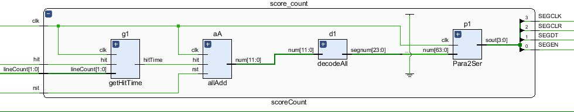
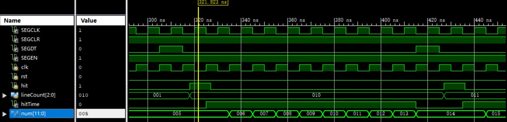
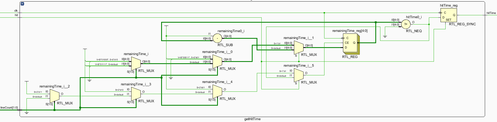
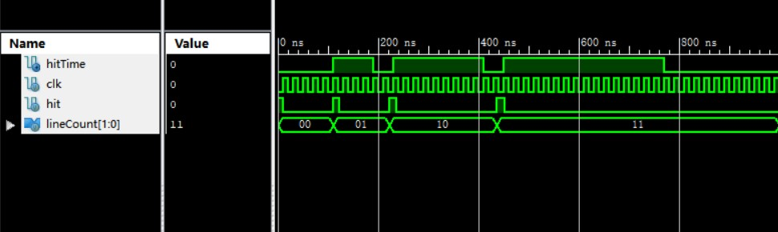
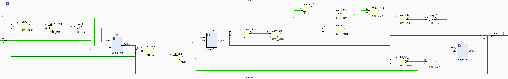
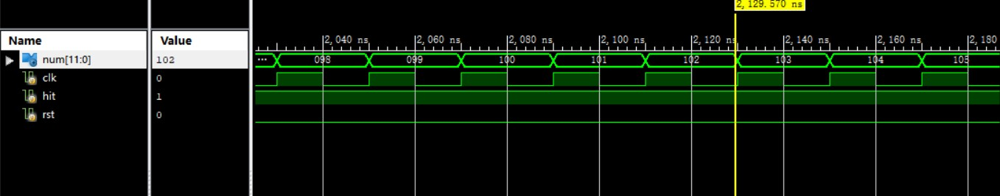
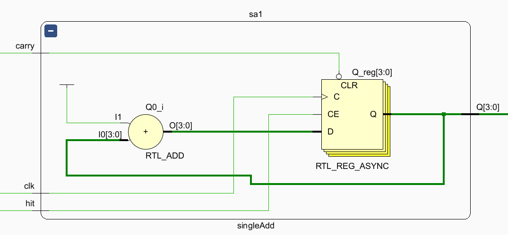
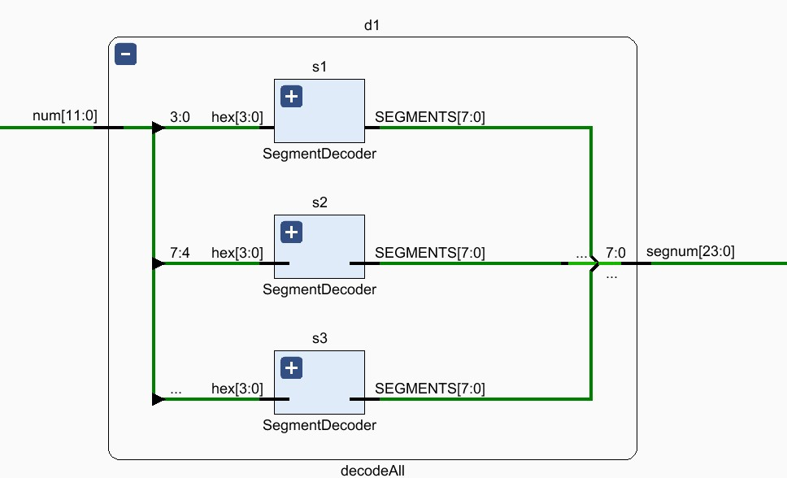
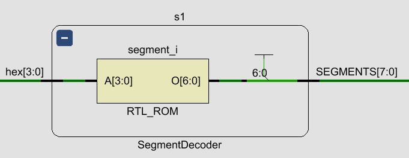
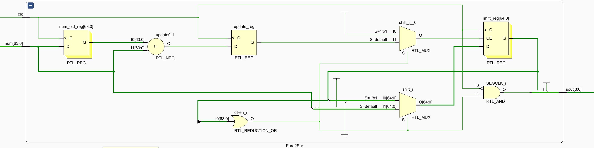

# scoreCount 模块

### 功能用途

+ 计算玩家得到的分数
+ 将分数显示至数码管上

## 调试过程

+ 在一开始使用如下的结构来进行设计，但是出现了仿真能通过而上板记录的分数有误的问题，因此这一版代码仅作保留参考，故放在调试过程当中。

### 模块结构

- scoreCount
   -  getHitTime
   - allAdd
      - singleAdd
   - decodeAll
      - SegmentDecoder
   - Para2Ser



### 输入

+ clk 
+ rst
+ hit
+ [1:0] lineCount

依次表示时钟，复位，是否击中以及一次击中了几行。在这里，一次击中了 x 行是通过 x - 1 表示的。即

+ lineCount == 2’b00 表示击中 1行
+ lineCount == 2’b01 表示击中 2行
+ lineCount == 2’b10 表示击中 3行
+ lineCount == 2’b11 表示击中 4行

根据俄罗斯方块的逻辑，一次最多只能击中四行，由于还有 hit 信号在，因此2位bit足够了。

### 输出

+ SEGCLK
+ SEGCLR
+ SEGDT
+ SEGEN

四个对应的都是八位七段数码管的显示信号的输出。

### 代码

```verilog
`timescale 1ns / 1ps

module scoreCount(
	input clk,
	input rst,
	input hit,
	input [1:0] lineCount,
	output SEGCLK, 
	output SEGCLR, 
	output SEGDT,
	output SEGEN
	);
	
wire hitTime;
wire [11:0] num;
wire [63:0] segnum;

// 根据得分情况输出要加的时钟周期
getHitTime g1(.clk(clk),.hit(hit),.lineCount(lineCount),.hitTime(hitTime));

// 加分，每 hit 的时候加 1
allAdd aA(.clk(clk),.hit(hitTime),.rst(rst),.num(num));

// 对数字译码到数码管
decodeAll d1(.num(num),.segnum(segnum[23:0]));

// 输出 SCORE 的大写字字母
assign segnum[63:56] = 8'b10010010;
assign segnum[55:48] = 8'b11000110;
assign segnum[47:40] = 8'b11000000;
assign segnum[39:32] = 8'b10001000;
assign segnum[31:24] = 8'b10000110;

// 将 segnum 的信号串行输出
Para2Ser p1(.clk(clk),.num(segnum),.sout({SEGCLK,SEGCLR,SEGDT,SEGEN}));

endmodule
```

#### 代码说明

+ 模块接受“消除了一行”的信号和“消除了几行”的信号。

+ 调用 getHitTime 模块，将消除几行换算成增加几分，然后将几分换算成输出几个时钟周期的 hitTime 信号。

+ 调用 allAdd 模块，使用 BCD 码来加分，每次读到一个 hitTime 信号，分数 + 1。

+ 渲染出 SCORE 的字母。

+ 复用以前实验写的显示模块来显示分数。

### 仿真测试

+ 由于最后的输出是数码管显示，因此计分模块仿真只看 getHitTime 和 allAdd 模块有没有输出正确的中间变量 num 即可，而译码和并行转串行在以往的课程中已经出现过，可以认为是能够正常工作的黑盒，不用再去仿真。

#### 仿真代码

```verilog
`timescale 1ns / 1ps

module sim_scoreCount;

	// Inputs
	reg clk;
	reg rst;
	reg hit;
	reg [2:0] lineCount;

	// Outputs
	wire SEGCLK;
	wire SEGCLR;
	wire SEGDT;
	wire SEGEN;

	// Instantiate the Unit Under Test (UUT)
	scoreCount uut (
		.clk(clk), 
		.rst(rst), 
		.hit(hit), 
		.lineCount(lineCount),  
		.SEGCLK(SEGCLK), 
		.SEGCLR(SEGCLR), 
		.SEGDT(SEGDT), 
		.SEGEN(SEGEN)
	);

	initial begin
		// Initialize Inputs
		clk = 0;
		rst = 1;
		hit = 0;
		lineCount = 0;

		// Wait 100 ns for global reset to finish
		#100;
		rst = 0;
      hit = 1;
		#9;
		hit = 0;
		#100;
		hit = 1;
		lineCount = 2'b01;
		#9;
		hit = 0;
		#100;
		hit = 1;
		lineCount = 2'b10;
		#9;
		hit = 0;
		#100;
		hit = 1;
		lineCount = 2'b11;
		#9;
		hit = 0;
		// Add stimulus here

	end
	always begin
		clk = 0; #5;
		clk = 1; #5;
	end
      
endmodule
```

#### 仿真结果



+ 由于 SEGDT 模块太难看懂，我们添加 num 和 hitTime 两个中间变量来观测，可以看到 num 成功地随着 hit 和 lineCount 的变化而更新了。而显示模块只是复用以前的，所以不会出错。


## getHitTime 模块

### 功能用途

+ 将玩家是否击中与击中的行数，转换成对应长度的高电平时钟周期信号。
+ 根据设计
  + 消除 1 行加 1 分；
  + 消除 2 行加 4 分；
  + 消除 3 行加 9 分；
  + 消除 4 行加 16 分
+ 比如，如果接收到一次性消除了3行，那么会传递 9（因为消除3行加9分）个时钟周期长度的 hitTime 高电平信号。

### 模块结构



### 输入

+ clk
+ hit
+ lineCount[1:0]

### 输出

+ hitTime

### 代码

```verilog
`timescale 1ns / 1ps

module getHitTime(
	input clk,
	input hit,
	input [1:0] lineCount,
	output reg hitTime
);

reg [4:0] remainingTime;
initial remainingTime = 0;

always @(negedge clk) begin
    if (hit == 1'b1) begin
		hitTime <= 1'b1;
        if (lineCount == 2'b01)
			remainingTime <= 4'b0011;
		else if (lineCount == 2'b10) 
			remainingTime <= 4'b1000;
		else if (lineCount == 2'b11) 
			remainingTime <= 4'b1111;
	end
	else if (remainingTime != 4'b0000) begin
		hitTime <= 1'b1;
		remainingTime <= remainingTime - 4'b0001;
	end
	else
		hitTime <= 1'b0;
end

endmodule
```

#### 代码说明

+ 模块接受“消除了一行”的信号和“消除了几行”的信号，输出相应时长的 hitTime。
+ 使用一个 remainingTime 寄存器储存还需要输出多长时间的 hitTime。
+ 当接受到 hit 信号的时候
  + 输出高电平的 hitTime
  + 将 lineCount 换算到相应的剩余时间 remainingTime。
+ 当没有 hit 信号的时候
  + 如果 remaingingTime 还有剩余
    + 输出高电平的 hitTime
    + remaingingTime 减一
  + 否则，输出低电平 hitTime 

### 仿真测试

#### 仿真代码

```verilog
`timescale 1ns / 1ps


module sim_getHitTime;

	// Inputs
	reg clk;
	reg hit;
	reg [1:0] lineCount;

	// Outputs
	wire hitTime;

	// Instantiate the Unit Under Test (UUT)
	getHitTime uut (
		.clk(clk), 
		.hit(hit), 
		.lineCount(lineCount), 
		.hitTime(hitTime)
	);

	initial begin
		// Initialize Inputs
		clk = 0;
		hit = 1;
		lineCount = 0;

		// Wait 100 ns for global reset to finish
		#10;
      hit = 0;
		#100;
		lineCount = 2'b01;
		hit = 1;
		#12;
		hit = 0;
		#100;
		lineCount = 2'b10;
		hit = 1;
		#15;
		hit = 0;
		#200;
		lineCount = 2'b11;
		hit = 1;
		#15;
		hit = 0;
		// Add stimulus here

	end
	
	always begin
		clk = 0; #10;
		clk = 1; #10;
	end
      
endmodule


```

#### 仿真结果



仿真结果表明

+ 在 hit 为 0 的时候（没有出现消除行的情况下），hitTime 始终为0。
+ 在 hit 为 1 且 lineCount 为 00 (表明消除了一行)，hitTime 为 1 个时钟周期。
+ 在 hit 为 1 且 lineCount 为 01(表明消除了两行)，hitTime 为 4 个时钟周期。
+ 在 hit 为 1 且 lineCount 为 10 (表明消除了三行)，hitTime 为 9 个时钟周期。
+ 在 hit 为 1 且 lineCount 为 11(表明消除了四行)，hitTime 为 16 个时钟周期。

可见，getHitTime 模块工作如预期。

## allAdd 模块

### 功能用途

+ 调用了 singleAdd 模块，在单一十进制进位的基础上，实现所有数的十进制的进位。
+ 每次接收到加分信号，就对分数加一分。
+ 难点是处理进位的关系。

### 模块结构



### 输入

+ clk
+ rst
+ hit

### 输出

+ num

num 即分数

### 代码

```verilog
`timescale 1ns / 1ps

module allAdd(
    input clk,
    input hit,
    input rst,
    output [11:0] num
    );

wire carry_1;
wire carry_2;
wire carry_3;

assign carry_1 = ~(num[1] & num[3] | rst);
assign carry_2 = ~(num[5] & num[7] & ~carry_1 | rst);
assign carry_3 = ~(num[9] & num[11] & ~carry_2 | rst);

wire hit_2;
wire hit_3;

assign hit_2 = (num[0]&num[3]) & hit;
assign hit_3 = (num[4]&num[7]) & hit_2;

singleAdd sa1(.clk(clk),.hit(hit),.carry(carry_1),.Q(num[3:0]));
singleAdd sa2(.clk(clk),.hit(hit_2),.carry(carry_2),.Q(num[7:4]));
singleAdd sa3(.clk(clk),.hit(hit_3),.carry(carry_3),.Q(num[11:8]));

endmodule

```

#### 代码说明

+ 核心是调用三个 singleAdd 模块，对应三个单数字的更新。
+ carry 是进位，需要指定每一个数字的进位，进位的时候会清零，和 rst 功能一样。进位的逻辑就是自己这一位要到10了，同时上一位也要到10了。
+ hit 是击中信号，对于每一个高位，其增加1的条件是低位位于 9 且正好来了一个增加信号。

### 仿真

#### 仿真代码

```verilog
`timescale 1ns / 1ps

module sim;

	// Inputs
	reg clk;
	reg hit;
	reg rst;

	// Outputs
	wire [11:0] num;

	// Instantiate the Unit Under Test (UUT)
	allAdd uut (
		.clk(clk), 
		.hit(hit), 
		.rst(rst), 
		.num(num)
	);

	initial begin
		// Initialize Inputs
		clk = 0;
		hit = 1;
		rst = 1;

		// Wait 100 ns for global reset to finish
		#100;
      rst = 0;
		// Add stimulus here

	end
   always begin
		clk = 0;#10;
		clk = 1;#10;
	end
endmodule


```

#### 仿真结果



+ 仿真结果（已切换到 Hexadecimal 显示）中可以看到，最容易出现问题的 100 交接的地方也顺利完成了自增操作。
+ allAdd 模块工作如预期。


## singleAdd 模块

### 功能用途

+ 核心是控制一个 4 位 BCD 码。

+ 当复位信号或者进位信号（由上层控制，指自己加到10了）来临时，输出0。

+ 当 hit 信号来临时，输出的值增加1。 

### 模块结构



### 输入

+ carry
+ clk
+ hit

carry 是进位信号，hit是击中要加一的信号

carry 也充当了 reset 的功能

### 输出

+ Q[3:0]

对应一位八段数码管上的数字的二进制码

### 仿真

#### 仿真代码


#### 仿真结果


## decodeAll 模块

### 功能用途

+ 将 32位 的 BCD 码（即 8 个十进制数）译码成八个七段数码管的对应值。
+ 其中调用了 SegmentDecoder 模块，用于对单一的4位二进制数译码成七段数码管的值。

### 模块结构



### 输入

+ num

### 输出

+ segnum

### 代码

```verilog
`timescale 1ns / 1ps

module decodeAll(
    input [11:0] num,
    output [23:0] segnum
);

SegmentDecoder s1(.hex(num[3:0]),.SEGMENTS(segnum[7:0]));
SegmentDecoder s2(.hex(num[7:4]),.SEGMENTS(segnum[15:8]));
SegmentDecoder s3(.hex(num[11:8]),.SEGMENTS(segnum[23:16]));
```

### 仿真

+ 由于这一段仿真意义不大，因此不做仿真


## SegmentDecoder 模块

### 功能用途

+ 将对应一位数字的四位 BCD 码译码成八段数码管的显示格式

### 模块结构



### 输入

+ hex[3:0]

### 输出

+ SEGMENTS[7:0]

### 代码

```verilog
`timescale 1ns / 1ps

module SegmentDecoder(
	input [3:0] hex, 
	output wire [7:0] SEGMENTS
);

reg [6:0] segment;
    always @*
        begin
            case(hex)
                4'h0: segment[6:0] <= 7'b1000000;
                4'h1: segment[6:0] <= 7'b1111001;
                4'h2: segment[6:0] <= 7'b0100100;
                4'h3: segment[6:0] <= 7'b0110000;
                4'h4: segment[6:0] <= 7'b0011001;
                4'h5: segment[6:0] <= 7'b0010010;
                4'h6: segment[6:0] <= 7'b0000010;
                4'h7: segment[6:0] <= 7'b1111000;
                4'h8: segment[6:0] <= 7'b0000000;
                4'h9: segment[6:0] <= 7'b0010000;
                4'hA: segment[6:0] <= 7'b0001000;
                4'hB: segment[6:0] <= 7'b0000011;
                4'hC: segment[6:0] <= 7'b1000110;
                4'hD: segment[6:0] <= 7'b0100001;
                4'hE: segment[6:0] <= 7'b0000110;
                4'hF: segment[6:0] <= 7'b0001110;
            endcase
        end
    assign SEGMENTS[6:0] = segment[6:0];
    assign SEGMENTS[7] = 1; 
endmodule
```

### 仿真

+ 由于这一段仿真意义不大，因此不做仿真


## Para2Ser 模块

### 功能用途

+ 串行转并行，用于数码管显示

### 模块结构



### 输入

+ num

### 输出

+ sout[3:0]

### 代码

```verilog
`timescale 1ns / 1ps

module Para2Ser(
	input [63:0] num,
	input clk,
	output [3:0] sout
    );

wire SEGCLK,SEGCLR,SEGDT,SEGEN;
assign sout[3:0]={SEGCLK,SEGCLR,SEGDT,SEGEN};

reg [64:0] shift;
initial shift = 0;
reg [63:0] num_old;
reg update;

wire clken;
assign clken = | shift[63:0];
assign SEGCLK = ~clk & clken;
assign SEGDT = shift[64];
assign SEGCLR = 1'b1;
assign SEGEN = 1'b1;
initial num_old = 0;

always @(posedge clk) begin
	num_old <= num;
	if(num_old != num)
		update <= 1;
	else 
		update <= 0;
	if(clken)
		shift = {shift[63:0],1'b0};
	else if (update)
		shift = {num,1'b1};
end

endmodule

```

### 仿真

+ 由于这一段仿真意义不大，因此不做仿真
